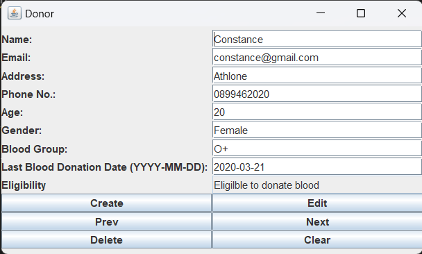

# BloodDonor_FactoryDesign

1. Run Main.java
2. Run GUI.java
3. A window will be pop up.
4. Type in the user's details and click create.
5. The eligibility of donating blood will be displayed either Eligible to donate blood or Not eligible to donate blood. 

## Output
